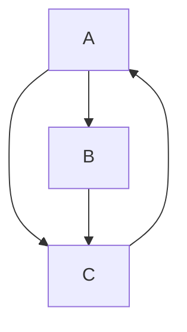

PageRank is an algorithm developed by Larry Page and Sergey Brin in the late 1990s, which became the foundation of Google's search engine ranking system. It models the web as a directed graph, where web pages are nodes and hyperlinks are directed edges. The core idea is to estimate the **importance** (or "authority") of a page based on the quantity and quality of links pointing to it. Intuitively, PageRank simulates a "random surfer" who browses the web by following links and occasionally jumping to a random page. Pages that are frequently visited in this model are deemed more important.

PageRank revolutionized web search by providing a way to rank results objectively, rather than relying solely on keyword matches.

## The Random Surfer Model

Imagine a user starting on a random web page and repeatedly doing one of two things:

- **Follow a link**: With probability \(1 - d\) (where \(d\) is the damping factor, typically 0.85), the surfer clicks a random outgoing link from the current page.

- **Teleport**: With probability \(d\), the surfer gets bored and jumps to any random page in the web (uniformly chosen).

This process continues indefinitely. The PageRank of a page is the long-term probability that the surfer lands on it after many steps. This probability stabilizes into a steady-state distribution, which we can compute mathematically.

## Mathematical Formulation

Let’s formalize this. Suppose there are \(n\) pages in the web, labeled \(1\) to \(n\). Let \(p_i\) be the PageRank of page \(i\).

- \(L_i\): The number of outgoing links from page \(i\).
- The transition probability from page \(j\) to page \(i\) is \(\displaystyle \frac{1}{L_j}\) if \(j\) links to \(i\), else 0.

The PageRank equation for page \(i\) is:

\[
p_i = \frac{d}{n} + d \sum_{j \in \text{links to } i} \frac{p_j}{L_j}
\]

- The first term \(\displaystyle \frac{d}{n}\) accounts for the random teleport (equal chance for any page).
- The second term sums the PageRank "votes" from pages linking to \(i\), weighted by how many outgoing links those pages have (to avoid spamming via link farms).

This is a system of linear equations: \(\displaystyle \mathbf{p} = d \mathbf{E} \mathbf{p} + \frac{d}{n} \mathbf{1}\), where \(\mathbf{E}\) is the transpose of the adjacency matrix (column-stochastic, normalized by out-degrees), and \(\mathbf{1}\) is a vector of ones. Solving for the eigenvector gives the PageRank vector \(\mathbf{p}\) with \(\displaystyle \sum p_i = 1\).

The damping factor \(d \approx 0.85\) ensures convergence (the Markov chain is irreducible and aperiodic) and models real browsing (about 15% random jumps).

## The Computation Process

To compute PageRank:

1. **Initialize**: Set all \(p_i = \displaystyle \frac{1}{n}\).
2. **Iterate**: Repeatedly apply the PageRank formula until convergence (e.g., changes < ε, like 0.0001).
3. **Power Iteration**: This is essentially the power method for finding the dominant eigenvector of the transition matrix \(\displaystyle M = d \mathbf{E} + \frac{(1-d)}{n} \mathbf{J}\) (where \(\mathbf{J}\) is all-ones matrix).

For large graphs (billions of pages), Google uses optimized sparse matrix techniques and distributed computing. Convergence typically takes 20–50 iterations.

#### Simple Example

Consider a tiny web with 3 pages:

- Page A links to B and C.
- Page B links to C.
- Page C links to A.

Adjacency: A → B,C; B → C; C → A.

Using \(d=0.85\), \(n=3\):

Initial: \(p_A = p_B = p_C = 1/3 \approx 0.333\).

After iterations (approximate steady state):

- \(p_A \approx 0.382\)
- \(p_B \approx 0.208\)
- \(p_C \approx 0.410\)

Page C ranks highest because it's part of a cycle and gets "votes" from both A and B.

| Iteration | p_A     | p_B     | p_C     |
|-----------|---------|---------|---------|
| 0        | 0.333   | 0.333   | 0.333   |
| 1        | 0.368   | 0.215   | 0.417   |
| 2        | 0.380   | 0.208   | 0.412   |
| 3        | 0.382   | 0.208   | 0.410   |
| Converged| 0.382   | 0.208   | 0.410   |

(This table shows how values stabilize; in practice, you'd solve the exact system.)

### Key Properties and Limitations

-   __**Strengths**__

    ---

    - Robust to spam: Quality links from authoritative pages carry more weight.
    - Global view: Considers the entire web structure.
    - Scalable: Linear algebra makes it efficient.

-   __**Limitations**__ (addressed in modern variants like Personalized PageRank)

    ---

    - Ignores content: Purely link-based.
    - Link farms: Groups of pages mutually linking to inflate ranks (mitigated by penalties).
    - Dead ends: Pages with no outgoing links (handled by assuming they teleport).
    - Spam evolution: Modern Google combines PageRank with hundreds of signals (e.g., machine learning).

PageRank's influence extends beyond search—to recommendation systems, social networks, and graph analytics. It's a cornerstone of spectral graph theory. For deeper dives, the original 1998 paper ["The PageRank Citation Ranking"](http://ilpubs.stanford.edu:8090/422/1/1999-66.pdf){:target="_blank"} is a great read.

## Additional

<iframe width="100%" height="460" src="https://www.youtube.com/embed/y4ArAo8c73Y" title="PageRank: COMO funciona o ALGORITMO Matemático do GOOGLE" frameborder="0" allow="accelerometer; autoplay; clipboard-write; encrypted-media; gyroscope; picture-in-picture; web-share" referrerpolicy="strict-origin-when-cross-origin" allowfullscreen></iframe>

[^1]: [Wikipedia: PageRank](https://en.wikipedia.org/wiki/PageRank){:target="_blank"}
[^2]: [GeeksforGeeks: PageRank Algorithm and Implementation](https://www.geeksforgeeks.org/python/page-rank-algorithm-implementation/){:target="_blank"}

---

## Exercício

!!! success inline end "Entrega"

    :calendar: **07.nov** :clock3: **23:59**

    :material-account: Individual

    :simple-target: Entrega do link via [Canvas](https://canvas.espm.br/){:target="_blank"}.

O objetivo deste exercício é implementar e aplicar o algoritmo PageRank em um grafo dirigido (ou adaptado de um grafo não dirigido, tratando arestas como bidirecionais). O PageRank é um algoritmo clássico para medir a importância de nós em uma rede, baseado na estrutura de links (ou relações). Ele pode ser usado para ranquear páginas web, mas aqui focamos em aplicações variadas.

**Tarefa Principal:**

1. Escolha um dos datasets sugeridos (ou equivalente) de pelo menos um dos tipos de dados propostos;
2. Carregue o grafo usando uma biblioteca como NetworkX (em Python) ou equivalente;
3. Implemente o algoritmo PageRank do zero (usando a fórmula iterativa: \( \displaystyle PR(p_i) = \frac{1-d}{N} + d \sum_{p_j \in M(p_i)} \frac{PR(p_j)}{L(p_j)} \), onde \( d \) é o fator de amortecimento, tipicamente 0.85; \( N \) é o número de nós; \( M(p_i) \) são os nós que apontam para \( p_i \); \( L(p_j) \) é o número de saídas de \( p_j \));
4. Compute os valores de PageRank para os nós do grafo (use um critério de convergência, como diferença menor que 0.0001 entre iterações);
5. Compare os resultados com uma implementação pronta (ex.: `networkx.pagerank`);
6. Analise os resultados: identifique os 10 nós mais importantes e explique o que eles representam no contexto do dataset (ex.: por que certos nós são mais "influentes"?);
7. Varie o fator de amortecimento (ex.: 0.5, 0.85, 0.99) e discuta o impacto nos rankings.

#### Sugestões de Datasets e Formas de Aplicação

Escolha pelo menos um dataset de cada tipo para variedade, mas o exercício pode ser feito com apenas um. Todos os datasets sugeridos são públicos e gratuitos, disponíveis em repositórios como Stanford SNAP (https://snap.stanford.edu/data/) ou Network Repository (https://networkrepository.com/). Baixe os arquivos de arestas (geralmente em formato .txt ou .edges) e carregue como grafo dirigido ou não dirigido no NetworkX.

1. **Tipo de Dados: Rede Social (ex.: rede de confiança ou amizades)**

    - **Dataset Sugerido:** soc-Epinions1 (da Epinions, uma rede de confiança entre usuários de um site de reviews). Disponível em SNAP: https://snap.stanford.edu/data/soc-Epinions1.html. Tamanho: ~76k nós, ~509k arestas dirigidas (usuários confiam em outros).

    - **Forma de Aplicação:** Modele o grafo como dirigido, onde uma aresta A → B significa que A confia em B. Aplique PageRank para identificar usuários mais "influentes" (aqueles com mais confiança indireta). Interprete: Nós com alto PageRank são influenciadores na comunidade, pois recebem confiança de fontes confiáveis. Use para analisar propagação de opiniões ou recomendações sociais.

2. **Tipo de Dados: Rede de Citações Acadêmicas (ex.: papers citando outros)**

    - **Dataset Sugerido:** cit-HepTh (citações em papers de Física de Alta Energia, do arXiv). Disponível em SNAP: https://snap.stanford.edu/data/cit-HepTh.html. Tamanho: ~28k nós (papers), ~353k arestas dirigidas (citações).

    - **Forma de Aplicação:** Grafo dirigido: uma aresta A → B significa que paper A cita paper B (B é "importante" para A). PageRank ranqueia papers mais impactantes (aqueles citados por papers influentes). Interprete: Papers com alto score são fundamentais no campo, como trabalhos seminais. Útil para análise de impacto científico ou recomendação de leitura.

3. **Tipo de Dados: Rede Biológica (ex.: interações entre proteínas)**

    - **Dataset Sugerido:** bio-Dmela (interações proteína-proteína em Drosophila melanogaster, da mosca da fruta). Disponível em Network Repository: https://networkrepository.com/bio-Dmela.php. Tamanho: ~7k nós (proteínas), ~26k arestas não dirigidas (interações; adapte para bidirecional).

    - **Forma de Aplicação:** Converta o grafo não dirigido em dirigido bidirecional (adicionando arestas em ambas direções). Aplique PageRank para identificar proteínas "centrais" na rede biológica. Interprete: Proteínas com alto PageRank são hubs em pathways metabólicos ou sinalização celular, potencialmente alvos para estudos de doenças. Útil em bioinformática para priorizar genes/proteínas.

**Dicas Gerais para Aplicação:**

- Para datasets grandes, use amostras (subgrafos) se o computation for lento.
- Bibliotecas: NetworkX para grafos, NumPy para cálculos matriciais (PageRank pode ser implementado via matriz de transição).
- Se precisar de mais opções: Outros datasets incluem roadNet-CA (redes de estradas, para análise de tráfego) ou ego-Facebook (redes sociais pessoais).

#### Rubricas de Correção

A correção será baseada em uma escala de 0 a 10 pontos, dividida em critérios. O total é somado e normalizado. Exija evidências no código e relatório.

1. **Implementação do Algoritmo (3 pontos)**

    - 3: Implementação correta do zero, com iterações, convergência e variação de d; compara com biblioteca pronta sem erros.
    - 2: Implementação funcional, mas com pequenos erros ou sem variação de d.
    - 1: Implementação parcial ou só usando biblioteca pronta.
    - 0: Não implementado ou com erros graves.

2. **Carregamento e Preparação do Dataset (2 pontos)**

    - 2: Dataset escolhido corretamente carregado; grafo modelado adequadamente (dirigido/bidirecional); pelo menos um tipo de dados usado.
    - 1: Carregamento ok, mas sem adaptação para o tipo de grafo ou escolha inadequada.
    - 0: Erros no carregamento ou dataset irrelevante.

3. **Análise e Interpretação dos Resultados (3 pontos)**

    - 3: Identifica top nós com explicação contextual clara; discute impacto de d; inclui visualizações relevantes.
    - 2: Análise básica, mas superficial ou sem discussão de variações.
    - 1: Apenas lista resultados sem interpretação.
    - 0: Sem análise.

4. **Qualidade do Código e Relatório (1 ponto)**

    - 1: Código limpo, comentado; relatório bem estruturado, sem plágio.
    - 0.5: Código funcional mas bagunçado; relatório incompleto.
    - 0: Código ilegível ou relatório ausente.

5. **Originalidade e Profundidade (1 ponto)**

    - 1: Usa mais de um dataset ou explora aplicações criativas; insights além do básico.
    - 0.5: Atende ao mínimo.
    - 0: Cópia ou superficial.

A entrega deve ser feita através do [Canvas](https://canvas.espm.br/) - **Exercício Page Rank**. Só serão aceitos links para repositórios públicos do GitHub contendo a documentação (relatório) e o código do projeto. Conforme exemplo do [template-projeto-integrador](https://hsandmann.github.io/documentation.template/){:target="_blank"}. ESTE EXERCÍCIO É INDIVIDUAL.
