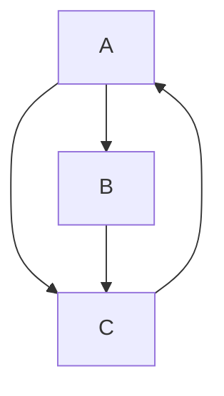

PageRank is an algorithm developed by Larry Page and Sergey Brin in the late 1990s, which became the foundation of Google's search engine ranking system. It models the web as a directed graph, where web pages are nodes and hyperlinks are directed edges. The core idea is to estimate the **importance** (or "authority") of a page based on the quantity and quality of links pointing to it. Intuitively, PageRank simulates a "random surfer" who browses the web by following links and occasionally jumping to a random page. Pages that are frequently visited in this model are deemed more important.

PageRank revolutionized web search by providing a way to rank results objectively, rather than relying solely on keyword matches.

## The Random Surfer Model

Imagine a user starting on a random web page and repeatedly doing one of two things:

- **Follow a link**: With probability \(1 - d\) (where \(d\) is the damping factor, typically 0.85), the surfer clicks a random outgoing link from the current page.

- **Teleport**: With probability \(d\), the surfer gets bored and jumps to any random page in the web (uniformly chosen).

This process continues indefinitely. The PageRank of a page is the long-term probability that the surfer lands on it after many steps. This probability stabilizes into a steady-state distribution, which we can compute mathematically.

## Mathematical Formulation

Let’s formalize this. Suppose there are \(n\) pages in the web, labeled \(1\) to \(n\). Let \(p_i\) be the PageRank of page \(i\).

- \(L_i\): The number of outgoing links from page \(i\).
- The transition probability from page \(j\) to page \(i\) is \(\displaystyle \frac{1}{L_j}\) if \(j\) links to \(i\), else 0.

The PageRank equation for page \(i\) is:

\[
p_i = \frac{d}{n} + d \sum_{j \in \text{links to } i} \frac{p_j}{L_j}
\]

- The first term \(\displaystyle \frac{d}{n}\) accounts for the random teleport (equal chance for any page).
- The second term sums the PageRank "votes" from pages linking to \(i\), weighted by how many outgoing links those pages have (to avoid spamming via link farms).

This is a system of linear equations: \(\displaystyle \mathbf{p} = d \mathbf{E} \mathbf{p} + \frac{d}{n} \mathbf{1}\), where \(\mathbf{E}\) is the transpose of the adjacency matrix (column-stochastic, normalized by out-degrees), and \(\mathbf{1}\) is a vector of ones. Solving for the eigenvector gives the PageRank vector \(\mathbf{p}\) with \(\displaystyle \sum p_i = 1\).

The damping factor \(d \approx 0.85\) ensures convergence (the Markov chain is irreducible and aperiodic) and models real browsing (about 15% random jumps).

## The Computation Process

To compute PageRank:

1. **Initialize**: Set all \(p_i = \displaystyle \frac{1}{n}\).
2. **Iterate**: Repeatedly apply the PageRank formula until convergence (e.g., changes < ε, like 0.0001).
3. **Power Iteration**: This is essentially the power method for finding the dominant eigenvector of the transition matrix \(\displaystyle M = d \mathbf{E} + \frac{(1-d)}{n} \mathbf{J}\) (where \(\mathbf{J}\) is all-ones matrix).

For large graphs (billions of pages), Google uses optimized sparse matrix techniques and distributed computing. Convergence typically takes 20–50 iterations.

#### Simple Example

Consider a tiny web with 3 pages:

- Page A links to B and C.
- Page B links to C.
- Page C links to A.

Adjacency: A → B,C; B → C; C → A.

Using \(d=0.85\), \(n=3\):

Initial: \(p_A = p_B = p_C = 1/3 \approx 0.333\).

After iterations (approximate steady state):

- \(p_A \approx 0.382\)
- \(p_B \approx 0.208\)
- \(p_C \approx 0.410\)

Page C ranks highest because it's part of a cycle and gets "votes" from both A and B.

| Iteration | p_A     | p_B     | p_C     |
|-----------|---------|---------|---------|
| 0        | 0.333   | 0.333   | 0.333   |
| 1        | 0.368   | 0.215   | 0.417   |
| 2        | 0.380   | 0.208   | 0.412   |
| 3        | 0.382   | 0.208   | 0.410   |
| Converged| 0.382   | 0.208   | 0.410   |

(This table shows how values stabilize; in practice, you'd solve the exact system.)

### Key Properties and Limitations

-   __**Strengths**__

    ---

    - Robust to spam: Quality links from authoritative pages carry more weight.
    - Global view: Considers the entire web structure.
    - Scalable: Linear algebra makes it efficient.

-   __**Limitations**__ (addressed in modern variants like Personalized PageRank)

    ---

    - Ignores content: Purely link-based.
    - Link farms: Groups of pages mutually linking to inflate ranks (mitigated by penalties).
    - Dead ends: Pages with no outgoing links (handled by assuming they teleport).
    - Spam evolution: Modern Google combines PageRank with hundreds of signals (e.g., machine learning).

PageRank's influence extends beyond search—to recommendation systems, social networks, and graph analytics. It's a cornerstone of spectral graph theory. For deeper dives, the original 1998 paper ["The PageRank Citation Ranking"](http://ilpubs.stanford.edu:8090/422/1/1999-66.pdf){:target="_blank"} is a great read.

## Additional

<iframe width="100%" height="460" src="https://www.youtube.com/embed/y4ArAo8c73Y" title="PageRank: COMO funciona o ALGORITMO Matemático do GOOGLE" frameborder="0" allow="accelerometer; autoplay; clipboard-write; encrypted-media; gyroscope; picture-in-picture; web-share" referrerpolicy="strict-origin-when-cross-origin" allowfullscreen></iframe>

[^1]: [Wikipedia: PageRank](https://en.wikipedia.org/wiki/PageRank){:target="_blank"}
[^2]: [GeeksforGeeks: PageRank Algorithm and Implementation](https://www.geeksforgeeks.org/python/page-rank-algorithm-implementation/){:target="_blank"}
