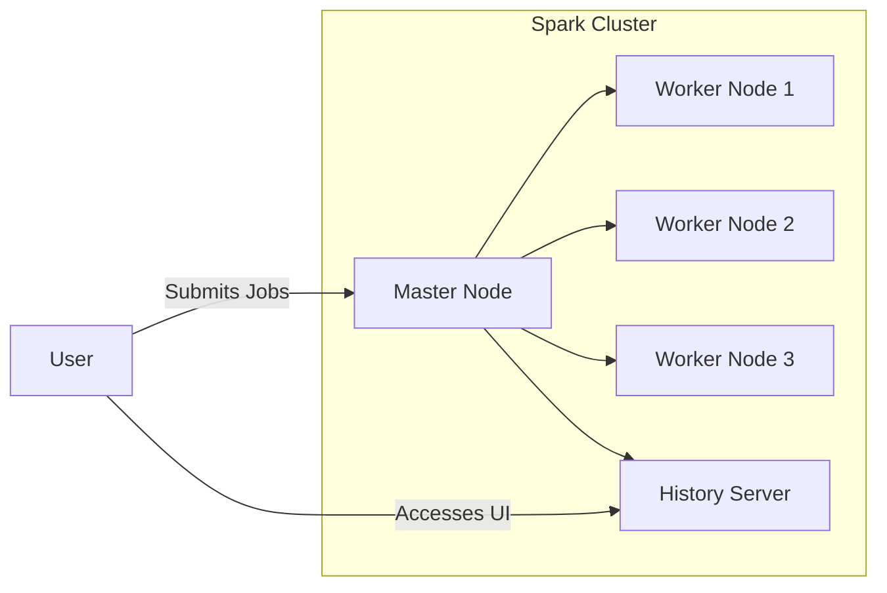

Spark is a powerful distributed computing framework widely used for big data processing and analytics. [Spark](https://spark.apache.org/){:target="_blank"} is an open-source unified analytics engine for large-scale data processing, with built-in modules for streaming, SQL, machine learning, and graph processing. It provides an interface for programming entire clusters with implicit data parallelism and fault tolerance.

In this section, we will explore how to set up and run a Spark cluster using Docker Compose. Adapted from [^1].

## Docker Setup for Spark Cluster

The Docker setup for Spark includes a directory structure that organizes configuration files, data, scripts, and logs. Below is an overview of the directory structure and its contents:

``` {.tree}
docker/
    config/ # (1)
        log4j2.properties # (2)
        spark-defaults.conf # (3)
    data/ # (4)
    scripts/ # (5)
    logs/ # (6)
    compose.yaml #(7)
    .gitignore
```

1. Contains configuration files for Spark.
2. Configuration file for Spark logging.
3. Default configuration settings for Spark.
4. Directory to store datasets used in Spark examples.
5. Contains helper scripts to start and manage the Spark environment.
6. Directory where Spark logs will be stored.
7. Docker Compose file to configure and start Spark services.

The configuration here defines a Spark master, three worker nodes, and a history server, along with necessary environment variables and volume mounts for configuration files and data.



=== "Compose file"

    To set up a Spark cluster using Docker Compose, use the following configuration ([compose.yaml](./docker/compose.yaml){:download="compose.yaml"}):

    ``` { .yaml .copy .select linenums="1" title="compose.yaml" }
    --8<-- "docs/classes/pyspark/docker/compose.yaml"
    ```

=== "Log4j Configuration"

    The `log4j2.properties` file configures logging for Spark. Below is a sample configuration ([log4j2.properties](./docker/config/log4j2.properties){:download="log4j2.properties"}):

    ``` { .properties .copy .select linenums="1" title="log4j2.properties" }
    --8<-- "docs/classes/pyspark/docker/config/log4j2.properties"
    ```

=== "Spark Defaults Configuration"

    The `spark-defaults.conf` file sets default configurations for Spark. Below is a sample configuration ([spark-defaults.conf](./docker/config/spark-defaults.conf){:download="spark-defaults.conf"}):

    ``` { .conf .copy .select linenums="1" title="spark-defaults.conf" }
    --8<-- "docs/classes/pyspark/docker/config/spark-defaults.conf"
    ```

**Starting the Spark Cluster**

To start the Spark cluster, navigate to the `docker/` directory and run the following command:

``` { .bash copy .select title="Start Spark Cluster" }
docker compose up -d --build
```


**Accessing Spark UI**

Once the Spark cluster is up and running, you can access the Spark Master UI and History Server UI through your web browser:

- Spark Master UI: [http://localhost:8080](http://localhost:8080){:target="_blank"}
- Spark History Server UI: [http://localhost:18080](http://localhost:18080){:target="_blank"}

These interfaces allow you to monitor the status of your Spark cluster, view running jobs, and analyze job history.

[^1]: [Running Spark using Docker Compose](https://karlchris.github.io/data-engineering/projects/spark-docker/#spark-history-server){:target="_blank"}