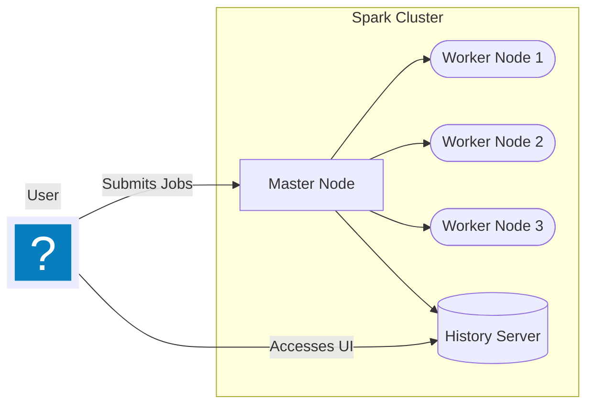

Spark is a powerful distributed computing framework widely used for big data processing and analytics. [Spark](https://spark.apache.org/){:target="_blank"} is an open-source unified analytics engine for large-scale data processing, with built-in modules for streaming, SQL, machine learning, and graph processing. It provides an interface for programming entire clusters with implicit data parallelism and fault tolerance.

In this section, we will explore how to set up and run a Spark cluster using Docker Compose. Adapted from [^1].

## Spark Cluster on Docker

The Docker setup for Spark includes a directory structure that organizes configuration files, data, scripts, and logs. Below is an overview of the directory structure and its contents:

``` {.tree}
docker/
    config/ # (1)
        log4j2.properties # (2)
        spark-defaults.conf # (3)
    data/ # (4)
    scripts/ # (5)
    logs/ # (6)
    compose.yaml #(7)
    .gitignore
```

1. Contains configuration files for Spark.
2. Configuration file for Spark logging.
3. Default configuration settings for Spark.
4. Directory to store datasets used in Spark examples.
5. Contains helper scripts to start and manage the Spark environment.
6. Directory where Spark logs will be stored.
7. Docker Compose file to configure and start Spark services.

=== "Compose file"

    To set up a Spark cluster using Docker Compose, use the following configuration ([compose.yaml](./docker/compose.yaml){:download="compose.yaml"}):

    ``` { .yaml .copy .select linenums="1" title="compose.yaml" }
    --8<-- "docs/classes/pyspark/docker/compose.yaml"
    ```

=== "Log4j Configuration"

    The `log4j2.properties` file configures logging for Spark. Below is a sample configuration ([log4j2.properties](./docker/config/log4j2.properties){:download="log4j2.properties"}):

    ``` { .properties .copy .select linenums="1" title="log4j2.properties" }
    --8<-- "docs/classes/pyspark/docker/config/log4j2.properties"
    ```

=== "Spark Defaults Configuration"

    The `spark-defaults.conf` file sets default configurations for Spark. Below is a sample configuration ([spark-defaults.conf](./docker/config/spark-defaults.conf){:download="spark-defaults.conf"}):

    ``` { .conf .copy .select linenums="1" title="spark-defaults.conf" }
    --8<-- "docs/classes/pyspark/docker/config/spark-defaults.conf"
    ```

### Starting

To start the Spark cluster, navigate to the `docker/` directory and run the following command:

``` { .bash copy .select title="Start Spark Cluster" }
docker compose up -d --build
```

The configuration defines a Spark master, three worker nodes, and a history server, along with necessary environment variables and volume mounts for configuration files and data.



### Accessing

Once the Spark cluster is up and running, you can access the Spark Master UI and History Server UI through your web browser:

- Spark Master UI: [http://localhost:8080](http://localhost:8080){:target="_blank"}
- Spark History Server UI: [http://localhost:18080](http://localhost:18080){:target="_blank"}

These interfaces allow you to monitor the status of your Spark cluster, view running jobs, and analyze job history.


### Setup

The whole sample with compose file, directory structure, and configuration could be found at [spark-docker.zip](https://github.com/hsandmann/ml/raw/refs/heads/main/docs/classes/pyspark/spark-docker.zip){:download="spark-docker.zip"} (~193 MB).

---

## Exercise

To further explore Spark and its capabilities, consider following this comprehensive tutorial that guides you through the basics of Pyspark and how to get started with it:

[Pyspark Tutorial: Getting Started with Pyspark](https://www.datacamp.com/tutorial/pyspark-tutorial-getting-started-with-pyspark){:target="_blank"} (starting from **Step 1: Creating a SparkSession**)

!!! tip inline end "Example"

    The [`ml.py`](https://github.com/hsandmann/ml/blob/main/docs/classes/pyspark/docker/scripts/ml.py){:target="_blank"} script in the `scripts/` directory provides a basic example of how to use Pyspark for machine learning tasks and this works with the same dataset as in the tutorial.

This tutorial covers essential topics such as setting up a Spark environment, loading and processing data, and performing basic data analysis using Pyspark. The dataset used in the tutorial can be found in the `data/` directory of the Docker setup. Also, feel free to experiment with the provided scripts in the `scripts/` directory to deepen your understanding of Spark's functionalities.

The exercise will help you gain hands-on experience with Spark and enhance your data processing skills using Pyspark.

!!! tip "Executing Scripts Inside the Spark Master Container"

    To run a script inside the Spark master container, use the following command:

    ```bash
    docker exec -it spark-master /opt/spark/bin/spark-submit /opt/spark/scripts/<your_script.py>
    ```

    Replace `<your_script.py>` with the name of the script you want to execute. This command allows you to submit Spark jobs directly from within the master node of your Spark cluster.

    The results could be accessed through the folder `data/` mounted inside the container at `/opt/spark/data/`.

    To plot graphs or visualize results, you might need to plot them in files (e.g., PNG) and then save them to the mounted `data/` directory for access outside the container.

    **Alternative:** You can also run the scripts from inside the Spark master container.

    <!-- termynal -->

    ``` shell
    > docker exec -it spark-master bash
    > spark@spark-master:/opt/spark$ spark-submit ./scripts/ml.py
    WARNING: Using incubator modules: jdk.incubator.vector
    ...
    ```

!!! warning "Adaptation is needed"

    Pay attention that running Spark in Docker may require adapting the code to work correctly within the containerized environment. This includes ensuring that file paths, environment variables, and dependencies are correctly set up to match the Docker configuration.

### Delivering

The exercise is considered complete when you have successfully set up the Spark cluster using Docker Compose, accessed the Spark UIs, executed at least one Pyspark script from the `scripts/` directory, and run the whole tutorial. Additionally, you should be able to analyze the results of your Spark jobs and visualize any outputs as needed.

Also, this exercise can be delivered by sharing a brief report or summary of your experience, including any challenges faced and how you overcame them while working with Spark in a Dockerized environment. The report can include screenshots of the Spark UIs, code snippets from the executed scripts, and any insights gained from the data analysis performed using Pyspark. Add the report to your learning portfolio (github Pages) for future reference.


### Criteria

| Points | Criteria                                                                                     |
|--------|----------------------------------------------------------------------------------------------|
|  2   | Spark cluster setup using Docker Compose is incomplete or not functional.                     |
|  2   | Spark cluster is set up, but access to Spark UIs is not demonstrated.                        |
|  1   | Executed at least one Pyspark example script.                           |
|  3   | Successfully executed the all tutorial. With plots and visualizations.          |
|  2   | Provided a comprehensive report on the experience.       |

[^1]: [Running Spark using Docker Compose](https://karlchris.github.io/data-engineering/projects/spark-docker/#spark-history-server){:target="_blank"}