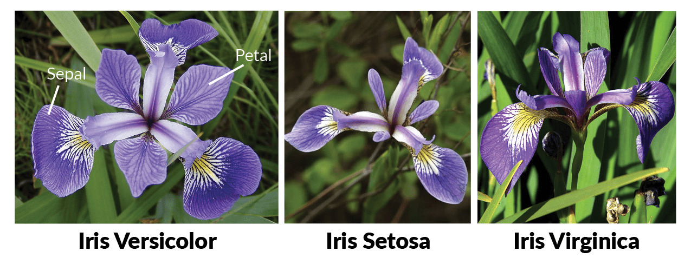

Todo os conceitos de Machine Learning são baseados em dados. A qualidade e a quantidade dos dados disponíveis são fundamentais para o sucesso de qualquer modelo de aprendizado de máquina. Neste contexto, é importante entender como os dados são estruturados, processados e utilizados para treinar modelos.


Exemplos de DB

Dados de treinamento

Dados de teste

Aprendizado supervisionado

baseado em exemplos

Existe o dado e o label (rótulo).

Balanceamento de classes

### Normalização (pré-processamento)

A normalização é uma etapa importante no pré-processamento de dados, especialmente quando se trabalha com algoritmos baseados em distância, como árvores de decisão. A normalização garante que todas as variáveis contribuam igualmente para a análise, evitando que variáveis com escalas maiores dominem o resultado.
### Estrutura do Documento
Normalização (pré-processamento )


## Exemplos de DB

https://archive.ics.uci.edu/dataset/53/iris


Iris Dataset

| sepal length<br>(cm) | sepal width<br>(cm) | petal length<br>(cm) | petal width<br>(cm) | class   |
|:--:|:--:|:--:|:--:|----|
| 5.1     | 3.5     | 1.4     | 0.2     | setosa  |
| 4.9     | 3.0     | 1.4     | 0.2     | setosa  |
| 4.7     | 3.2     | 1.3     | 0.2     | setosa  |
| 5.7     | 3.0     | 4.2     | 1.2     | versicolor |
| 5.7     | 2.9     | 4.2     | 1.3     | versicolor |
| 6.2     | 2.9     | 4.3     | 1.3     | versicolor |
| 6.7     | 3.0     | 5.2     | 2.3     | virginica |
| 6.3     | 2.5     | 5.0     | 1.9     | virginica |
| 6.5     | 3.0     | 5.2     | 2.0     | virginica |

```pyodide install="pandas,scikit-learn" exec="on" html="1"
--8<-- "docs/classroom/concepts/iris_data.py"
```

Visualização de dados

```python exec="1" html="1"
--8<-- "docs/classroom/concepts/iris_visualization.py"
```


PCA (Análise de Componentes Principais)


[^1]: Fisher, R. A.. 1936. Iris. UCI Machine Learning Repository.
[https://doi.org/10.24432/C56C76.](https://doi.org/10.24432/C56C76){:target="_blank"}

[^2]: [Iris Dataset - Wikipedia](https://en.wikipedia.org/wiki/Iris_flower_data_set){:target="_blank"}
