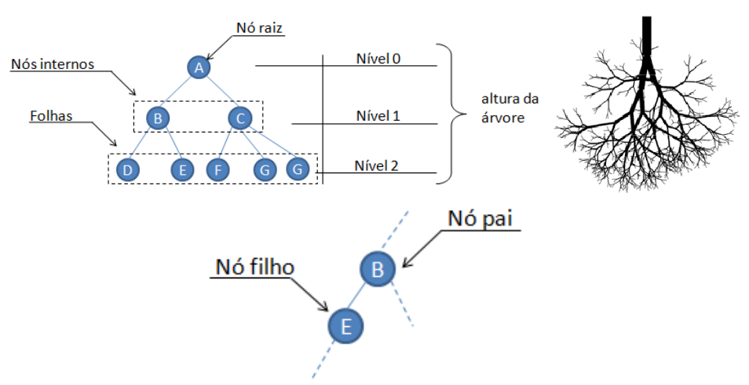

As **árvores de decisão** são uma técnica popular de **aprendizado de máquina supervisionado** usada para classificação e regressão. Elas representam decisões e suas possíveis consequências em uma estrutura hierárquica, facilitando a interpretação dos resultados.

``` mermaid
graph TD;
    T1((Teste 1)) -->|Sim| T2((Teste 2))
    T1 -->|Não| T3((Teste 3))
    T2 -->|Sim| R1[Resultado 1]
    T2 -->|Não| R2[Resultado 2]
    T3 -->|Sim| R3[Resultado 3]
    T3 -->|Não| R4[Resultado 4]
```

???+ example "Exemplo: ir para praia ou não?"

    Após dias de anotações sobre o comportamento de uma pessoa, foi possível criar uma tabela com os seguintes registros:

    | Dia | Sol? | Vento? | Praia? |
    |:---:|:----:|:------:|:------:|
    | 1   | Sim  | Sim    | Não    |
    | 2   | Sim  | Sim    | Não    |
    | 3   | Sim  | Não    | Sim    |
    | 4   | Não  | Não    | Não    |
    | 5   | Não  | Sim    | Não    |
    | 6   | Não  | Não    | Não    |

    A partir desses dados, podemos construir uma árvore de decisão para prever se a pessoa irá à praia com base nas condições climáticas.

    ``` mermaid
    graph TD;
        A((Sol?)) -->|Sim| B((Vento?))
        A -->|Não| C[Não ir à praia]
        B -->|Sim| D[Não ir à praia]
        B -->|Não| E[Ir à praia]
    ```
    /// caption
    Árvore de decisão simples para prever se a pessoa irá à praia com base nas condições climáticas. A partir da pergunta "Sol?", a árvore se divide em dois caminhos: se há sol, verifica-se se há vento. Se não há sol, a decisão é não ir à praia. Se não há vento, a decisão é ir à praia. Fonte: [Didatica Tech - Árvores de Decisão](https://didatica.tech/como-funciona-o-algoritmo-arvore-de-decisao/){:target="_blank"}.
    ///

## Considerações

!!! success "Vantagens"

    - **Interpretação fácil**: A estrutura em árvore facilita a visualização e compreensão das decisões tomadas pelo modelo.
    - **Não requer normalização**: Árvores de decisão não são sensíveis à escala dos dados, o que significa que não é necessário normalizar ou padronizar as variáveis.
    - **Capacidade de lidar com dados categóricos e numéricos**: Elas podem trabalhar com ambos os tipos de dados sem necessidade de transformação prévia.

!!! failure "Desvantagens"

    - **Tendência ao overfitting**: Árvores de decisão podem se ajustar demais aos dados de treinamento, capturando ruídos e padrões irrelevantes.
    - **Instabilidade**: Pequenas variações nos dados podem resultar em árvores completamente diferentes, tornando o modelo menos robusto.

## Nomenclatura

As árvores de decisão são compostas por **nós** (representando testes em atributos) e **folhas** (representando resultados ou classes finais). O processo de construção da árvore envolve a seleção do atributo mais informativo para dividir os dados em subconjuntos, minimizando a impureza (e.g., usando medidas como entropia ou índice Gini)[^1].


/// caption
Estrutura de uma Árvore de Decisão: os nós representam testes em atributos, enquanto as folhas representam os resultados finais. Fonte: [Aulas - Árvores](https://saulo.arisa.com.br/wiki/index.php/%C3%81rvores){:target="_blank"}.
///

O objetivo de uma árvore de decisão é criar uma estrutura que minimize a impureza dos nós, resultando em folhas que contenham exemplos da mesma classe ou com valores semelhantes. Isso é feito através de um processo iterativo de divisão dos dados, onde em cada nó é escolhido o atributo que melhor separa os dados em termos de classe ou valor.

Existem algumas métricas comuns usadas para medir a qualidade de uma divisão, incluindo:

- **Índice Gini**: Mede a impureza dos dados, onde um valor de 0 indica pureza total (todos os exemplos pertencem à mesma classe).
- **Entropia**: Mede a incerteza ou aleatoriedade dos dados, onde uma entropia de 0 indica que todos os exemplos pertencem à mesma classe.
- **Ganho de Informação**: Mede a redução da entropia após a divisão dos dados.
- **Redução da Variância**: Usada em árvores de decisão para regressão, mede a redução da variância dos valores após a divisão dos dados.
- **Chi-quadrado**: Usado para medir a independência entre variáveis categóricas, ajudando a identificar interações significativas entre atributos.


Cálculo do coeficiente de Gini:

$$
g_i = 1 - \sum_{i=1}^{n} p_i^2
$$

onde \( p_i \) é a proporção de cada classe \( i \) no conjunto de dados.

Cálculo da entropia:
$$
h_i = - \sum_{i=1}^{n} p_i \log_2(p_i)
$$

onde \( p_i \) é a proporção de cada classe \( i \) no conjunto de dados.


## Algoritmos

Os algoritmos mais comuns para construir árvores de decisão incluem:

- **ID3 (Iterative Dichotomiser 3)**: Um dos primeiros algoritmos, que usa a entropia para selecionar o atributo mais informativo.
- **C4.5**: Uma extensão do ID3 que lida com dados contínuos e ausentes, usando o ganho de informação.
- **CART (Classification and Regression Trees)**: Utiliza o índice Gini para classificação e a soma dos quadrados dos resíduos para regressão.
- **CHAID (Chi-squared Automatic Interaction Detector)**: Baseado em testes qui-quadrado, é usado para identificar interações entre variáveis.
- **MARS (Multivariate Adaptive Regression Splines)**: Um método que combina árvores de decisão com splines adaptativos, permitindo modelar relações não lineares complexas.


### Pseudocódigo
O pseudocódigo para construir uma árvore de decisão pode ser descrito da seguinte forma:
```plaintext
Função construir_árvore(dados, atributos):
    Se todos os exemplos em dados pertencem à mesma classe:
        Retorne folha com essa classe
    Se atributos estiver vazio:
        Retorne folha com classe majoritária em dados

    MelhorAtributo = escolher_melhor_atributo(dados, atributos)
    Arvore = novo_nó(MelhorAtributo)

    Para cada valor em MelhorAtributo:
        Subconjunto = filtrar_dados(dados, MelhorAtributo, valor)
        Se Subconjunto não estiver vazio:
            Arvore.filhos[valor] = construir_árvore(Subconjunto, atributos - {MelhorAtributo})
        Senão:
            Arvore.filhos[valor] = folha com classe majoritária em dados

    Retorne Arvore
Função escolher_melhor_atributo(dados, atributos):
    MelhorAtributo = None
    MelhorGanho = -infinito
    Para cada atributo em atributos:
        Ganho = calcular_ganho(dados, atributo)
        Se Ganho > MelhorGanho:
            MelhorGanho = Ganho
            MelhorAtributo = atributo
    Retorne MelhorAtributo
```

### Implementação com Bibliotecas

As árvores de decisão podem ser implementadas usando bibliotecas populares como `scikit-learn` em Python, que oferece uma interface simples para criar e treinar modelos de árvores de decisão. A seguir é um exemplo básico de como criar uma árvore de decisão para classificação:

=== "code"

    ```python exec="0"
    --8<-- "docs/classroom/decision_tree/decision_tree_iris.py"
    ```

=== "output"

    ```python exec="1" html="1"
    --8<-- "docs/classroom/decision_tree/decision_tree_iris.py"
    ```


!!! example "Exercício"

    Utilizando


[^1]: [Aulas - Árvores](https://saulo.arisa.com.br/wiki/index.php/%C3%81rvores){:target="_blank"}
[^2]: [Didatica Tech - Árvores de Decisão](https://didatica.tech/como-funciona-o-algoritmo-arvore-de-decisao/){:target="_blank"}